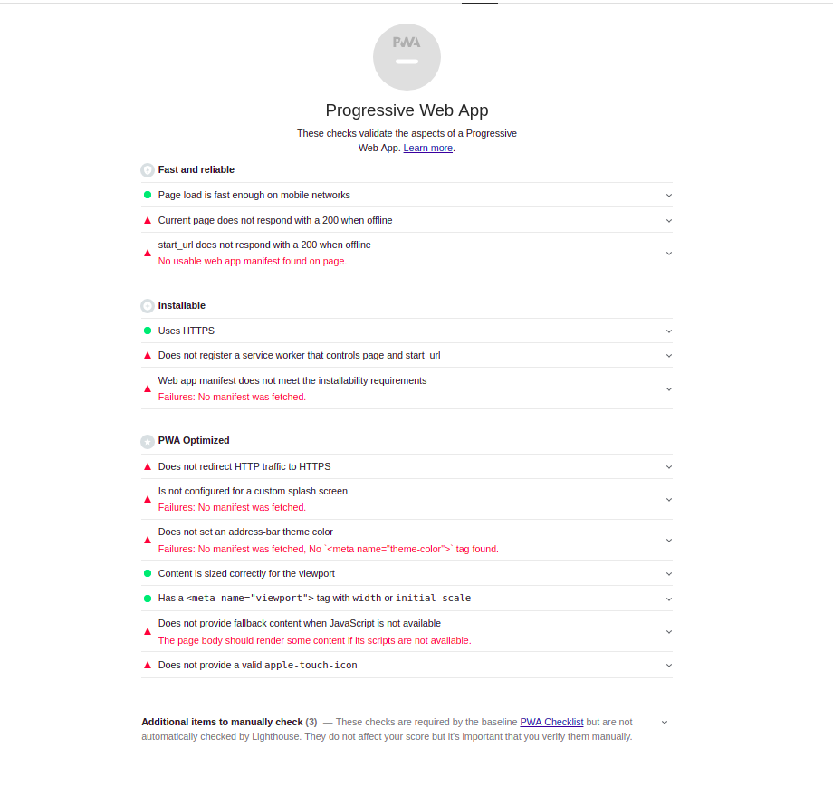

# Tutorial (Paso a paso)

En este artículo vamos a explicar cómo realizar con Angular una **`PWA`** e implementar diferentes **`Service Workers con la lógica personalizada que necesitemos`**.

## Paso 1
Primero, creamos nuestro proyecto de angular
```bash
ng new angular-pwa-sw-example
```


## Paso 2
Compilamos el proyecto en modo producción (output: ***/dist***).

```bash
ng build --prod
```
## Paso 3

Levantamos la aplicación con el paquete [http-server](https://www.npmjs.com/package/http-server) de npm con el siguiente comando para que evite cacheo.

```bash
http-server -p 8080 -c-1 dist/angular-pwa-sw-example
```

***Levantamos nuestra aplicación de esta manera porque el servidor de desarrollo de Angular ( `ng serve` ) no permite el uso de Service Workers.***

## Paso 4
Seguidamente ejecutamos la herramienta [Lighthouse](https://developers.google.com/web/tools/lighthouse/?hl=es) de Google para hacer la auditoría de nuestra web y saber si cumple los checks necesarios para ser una PWA.




Como podemos ver, nuestra aplicación no se puede considerar una PWA según los criterios de Lighthouse porque aún no tenemos ninguna implementación *(manifest, service workers, offline display, ...)* para que lo sea realmente.

## Paso 5
Con la ayuda de `@angular/cli` vamos a añadir las características de una pwa a nuestra aplicación fácilmente.

Ejecutamos en la raiz de nuestro proyecto angular:
```
ng add @angular/pwa
```
\
Automáticamente nos va a añadir una serie de nuevos archivos y va a añadir alguna que otra configuración a nuestro proyecto. 


- **angular.json:** 
  - manifest.json en assets
  - serviceWorker: true 
  - ngswConfigPath: archivo de configuración para el service worker ngsw
- **package.json:** Añade dependencia a `@angular/service-worker`
- **index.html:**
  - link a manifest.json
  - meta theme-color para cuando se "instale" en algún dispositivo
  - noscript html tag
- **manifest.json:** configuración de la aplicación para cuando se "instale" en el dispositivo
- **ngsw-config.json:** archivo de configuración y estrategias de cacheo para el service worker que crea angular.
- **app.module.ts:** registra e instala el service worker `ngsw-worker.js` *(auto generado por angular basado en ngsw-config.json)*
- **icons**: iconos en diferentes tamaños para usarse como icono de aplicación cuando se instale

## Paso 6
Ejecutamos de nuevo Lighthouse para volver a auditar nuestra aplicación y ver qué ha cambiado.


Como podemos ver, nuestra aplicación ya se considera una PWA y tiene la capacidad de ser instalada, ser usada offline, cachear tanto index.html como assets, css, ...etc.

Lo único que podemos ver que nos faltaría para cumplir todos y cada uno de los requisitos son:
- **Redireccionar el tráfico HTTP a HTTPS**: *(Esto lo realizaríamos a nivel de servidor. Al ser una prueba en local falla este punto)*
- **Proveer un icono especial para apple**:  *Como bien indica, lo más recomendado para iOS sería añadir un apartado especial para el icono cuando es "instalada" en iOS.*

