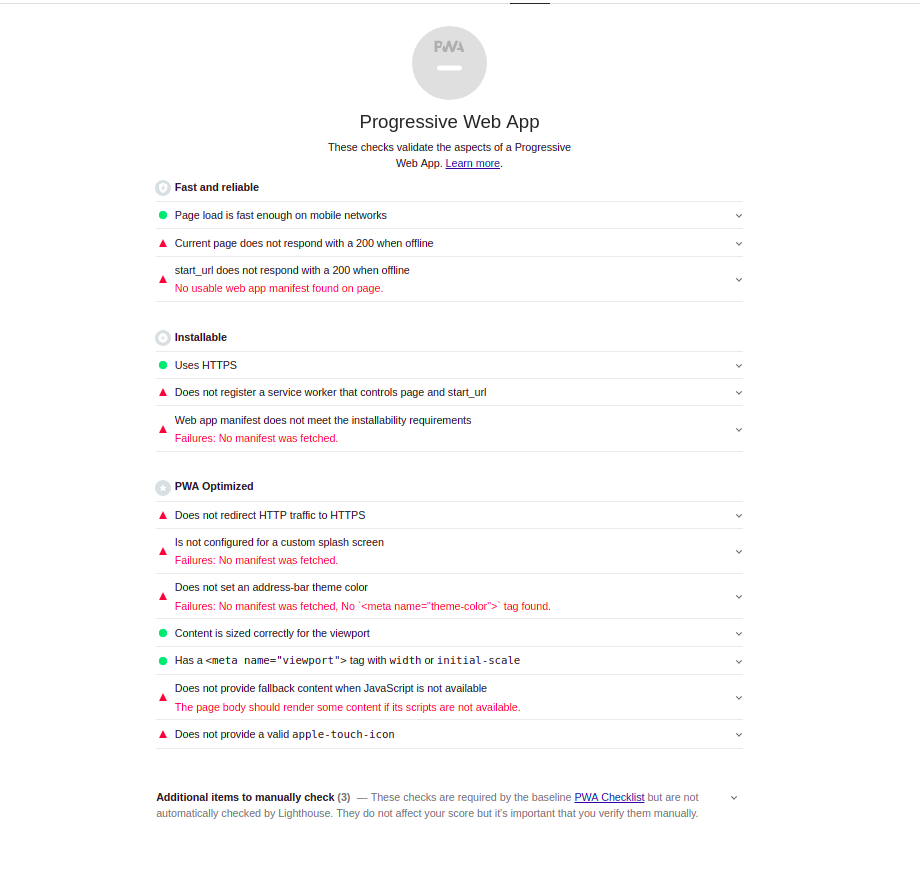
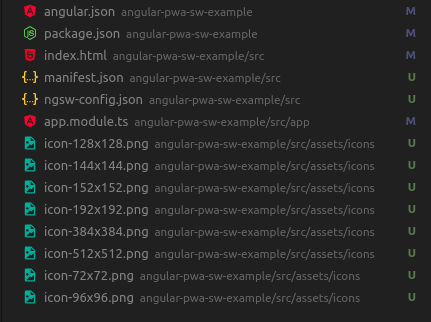
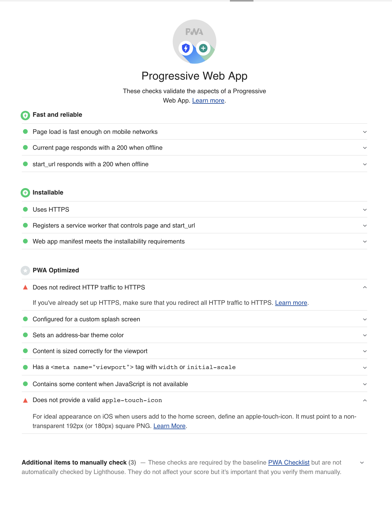

(ES) Idioma: Español
# Convierte tu aplicación Angular 🅰️ en una PWA ⚡

En estos tiempos en los que las PWA están cogiendo cada vez más protagonismo y nos aportan cada día más funcionalidades, vamos a ver como Angular nos permite implementar el modelo `Progressive Web Application (PWA)` a nuestra aplicación y transformarla en una de ellas fácilmente.


## ¿Qué es Angular? 🅰️

`Angular` es un *framework* de desarrollo para JavaScript creado por Google *(se desarrolla en Typescript)*. La finalidad de Angular es facilitarnos el desarrollo de aplicaciones web SPA y además, facilitarnos una serie de herramientas para trabajar con los elementos de una web de una manera más sencilla y óptima.

## ¿Cómo nos ayuda Angular en la creación de una PWA? 🤳

Angular dispone de una herramienta muy potente que nos ayuda a generar componentes, clases, interfaces, pipes, directivas,...etc. Esta herramienta es:  [@angular/cli](https://cli.angular.io/).

`@angular/cli` no sólo nos ayuda a crear los ficheros necesarios para cada acción *(ejemplo: generar un nuevo componente)* sino que también modifica los archivos necesarios, agrega paquetes y muchas cosas más... 

Seguidamente veremos como de fácil es añadir los archivos y configuraciones necesarias a nuestra app para que finalmente sea considerada una PWA.

**Empecemos!** ✈️


## Paso 1️⃣
Primero, creamos nuestro proyecto de angular
```bash
ng new angular-pwa-sw-example
```


## Paso 2️⃣
Compilamos el proyecto en modo producción, ya que vamos a realizar la misma prueba más adelante con la implementación de PWA y será necesario que se realice en modo producción (outputPath: ***/dist***).

```bash
ng build --prod
```
## Paso 3️⃣

Levantamos la aplicación con el paquete [http-server](https://www.npmjs.com/package/http-server) de npm con el siguiente comando para que evite cacheo.

```bash
http-server -p 8080 -c-1 dist/angular-pwa-sw-example
```

***Levantamos nuestra aplicación de esta manera porque el servidor de desarrollo de Angular ( `ng serve` ) no permite el uso de Service Workers. Así podemos realizar más tarde la comparativa del antes y el después en las mismas condiciones.***

## Paso 4️⃣
Seguidamente ejecutamos la herramienta [Lighthouse](https://developers.google.com/web/tools/lighthouse/?hl=es) de Google para hacer la auditoría de nuestra web y saber si cumple los checks necesarios para ser una PWA.




Como podemos ver, nuestra aplicación no se puede considerar una PWA según los criterios de Lighthouse porque aún no tenemos ninguna implementación *(manifest, service workers, offline display, ...)* para que lo sea realmente.

## Paso 5️⃣
Con la ayuda de `@angular/cli` vamos a añadir las características de una pwa a nuestra aplicación fácilmente.

Ejecutamos en la raiz de nuestro proyecto angular:
```
ng add @angular/pwa
```
\
Automáticamente nos va a añadir una serie de nuevos archivos y va a añadir alguna que otra configuración a nuestro proyecto. 




- **angular.json:** 
  - Añade manifest.json en el apartado de assets
  - Añade flag serviceWorker: true 
  - Añade configuración 'ngswConfigPath' con la ruta del archivo de configuración para el service worker ngsw-worker.js
- **package.json:** Añade dependencia a `@angular/service-worker`
- **index.html:**
  - link a manifest.json
  - meta theme-color para cuando se "instale" en algún dispositivo
  - noscript html tag
- **manifest.json:** configuración de la aplicación para cuando se "instale" en el dispositivo
- **ngsw-config.json:** archivo de configuración y estrategias de cacheo para el service worker que crea angular.
- **app.module.ts:** registra e instala el service worker `ngsw-worker.js` *(auto generado por angular basado en ngsw-config.json)*
- **icons**: iconos en diferentes tamaños para usarse como icono de aplicación cuando se instale en algún dispositivo

## Paso 6️⃣
Ejecutamos de nuevo Lighthouse para volver a auditar nuestra aplicación y ver qué ha cambiado.



Como podemos ver, nuestra aplicación ya se considera una PWA y tiene la capacidad de ser instalada, ser usada offline, cachear tanto index.html como assets, css, ...etc.

Los únicos puntos que podemos ver que nos faltaría para cumplir todos y cada uno de los requisitos son:
- **Redireccionar el tráfico HTTP a HTTPS:** *(Esto lo realizaríamos a nivel de servidor. Al ser una prueba en local falla este punto)*
- **Proveer un icono especial para apple:**  *Como bien indica, lo más recomendado para iOS sería añadir un apartado especial para un icono con un formato específico para cuando es "instalada".*